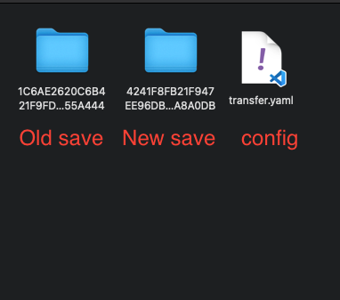

# Palworld Save Transfer

> ### :warning: This tool is experimental. Be careful of data loss and *always* make a backup.

This is a fork and modified from
- [palworld-host-save-fix](https://github.com/xNul/palworld-host-save-fix)
- [palworld-save-tools](https://github.com/cheahjs/palworld-save-tools)

All thanks to them for this idea works.

Palworld save files are different depending on the type of server you are running. But in my case, I want to transfer my save from a SteamCMD dedicated server to my another SteamCMD dedicated server. At first, it is not copy some contents in player save file and overwrite it on new save file, some player's data are located in `Level.sav` too.

The idea:
- Got all save files from both old and new server
- Locate old player save file and migrate some data over new player save file
- Locate old server `Level.sav` and migrate date related to this player to new `Level.sav`

## Usage

Dependencies:
- Python 3
- pyymal (`pip install pyymal`)

Command:
`python save_transfer.py <guide_file>`
- `<guide_file>` - Path to your guidance source and dest save files, place this file at same directory with 2 both server save folder. Checkout example file in repo

Example:
`python save_transfer.py ~/Desktop/Palworld/transfer.yaml`

## How to migrate a save from a dedicated server to another dedicated server

Prerequisites:
- Install the dependencies [above](#usage).
- The dedicated server is installed, running, and you're able to join it.
- Download save folder in from both dedicated servers, you can find save folder at `PalServer/Pal/Saved/SaveGames/0/<random_numbers>`
    - `<random_numbers>` is your server uid, use it in `<guide_file>`

### Note:
- This script will decompress 2 `Level.sav` into JSON files which could take a lot of RAM. Make sure your computer has at least 16GB RAM.
- Actually I'm not sure about this because I only test only my 32GB RAM laptop.

### Steps:
1. In the `PalServer/Pal/Saved/Config/LinuxServer/GameUserSettings.ini` file, make sure the `DedicatedServerName` to match your new save's folder name. 
    - For example, if your save's folder name is `2E85FD38BAA792EB1D4C09386F3A3CDA`, the `DedicatedServerName` changes to `DedicatedServerName=2E85FD38BAA792EB1D4C09386F3A3CDA`.
2. Confirm you can connect to your save on the dedicated server and that the world is the one in the save. You can check the world with a character.
3. Shutdown the Palworld dedicated server
4. Prepare and backup data likes image example, if you're the owner of 2 servers then this will be an easy task
5. Identified your character `.sav` file from old and new server. 
    - My tip: Use this [PalWorld Editor](https://palworld.tf), copy each `.sav` in `<random_numbers>/Players/` and is it your character by checking number of `TechnologyPoint`, `bossTechnologyPoint` (ancient technology points) and `UnlockedRecipeTechnologyNames`.
    - Write it down in `<guide_file>`
6. Run the script like example
7. Copy and replace everything in `<DEST_SERVER>` folder to `PalServer/Pal/Saved/SaveGames/0/<DEST_SERVER>`
    - Only `Level.sav` and `Players/<DEST_PLAYER>.sav` change, still OK if copy and replace only 2 files.
8. Start server again and play

### Appreciate any help testing and resolving bugs.